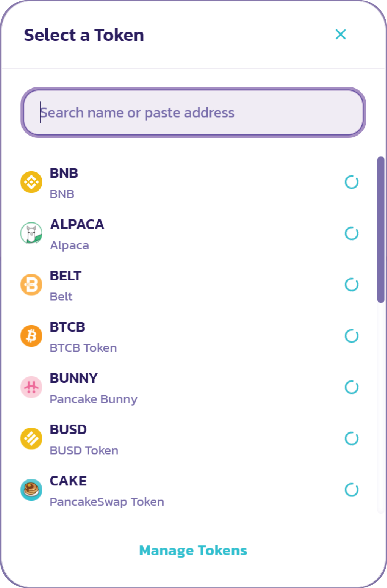

# Cómo comprar GYRO

**Cómo comprar GYRO**

Vaya a GYRO / USDT en PancakeSwap

* [https://pancakeswap.finance/swap?inputCurrency=0x55d398326f99059ff775485246999027b3197955\&outputCurrency=0x1b239abe619e74232c827fbe5e49a4c072bd869d](https://pancakeswap.finance/swap?inputCurrency=0x55d398326f99059ff775485246999027b3197955\&outputCurrency=0x1b239abe619e74232c827fbe5e49a4c072bd869d)
* Marque "Comprendo" y luego haga clic en "Importar".

.png>)

* Desde Swap Exchange, ingrese la cantidad en USDT que desea comprar y luego haga clic en "Enter".

.png>)

* PancakeSwap permite un enrutamiento inteligente. Puede comprar GYRO con otros activos además de USDT (es decir, BNB, USDC, etc.). Haga clic en "USDT" y aparecerá una ventana emergente; lo que le permite elegir otro activo para comprar.

