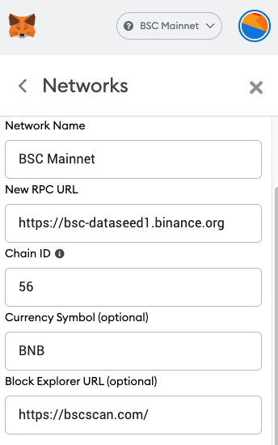

# Configurar Metamask

**Siga estos pasos para configurar Metamask para conectarse con BSC Mainnet**

**A. Conecte MetaMask a BSC Mainnet**

* Ir a la página de configuración

.png>)

* Agregar una nueva red

.png>)

* RPC: [https://bsc-dataseed1.binance.org](https://bsc-dataseed1.binance.org/)
* ChainID: 56
* Symbol: BNB
* Block Explorer: [https://bscscan.com/](https://bscscan.com/)

