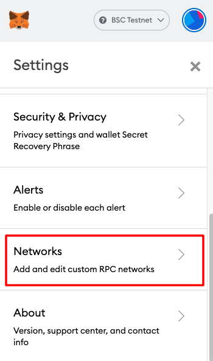

# Konfigurasi Metamask

**Ikuti langkah-langkah dibawah untuk mengatur Metamask agar terhubung dengan BSC Mainnet**

**A. Hubungkan MetaMask ke BSC Mainnet**

* Pergi ke halaman settings

.png>)

* Tambahkan Network baru

.png>)

* RPC: [https://bsc-dataseed1.binance.org](https://bsc-dataseed1.binance.org/)
* ChainID: 56
* Symbol: BNB
* Block Explorer: [https://bscscan.com/](https://bscscan.com/)

