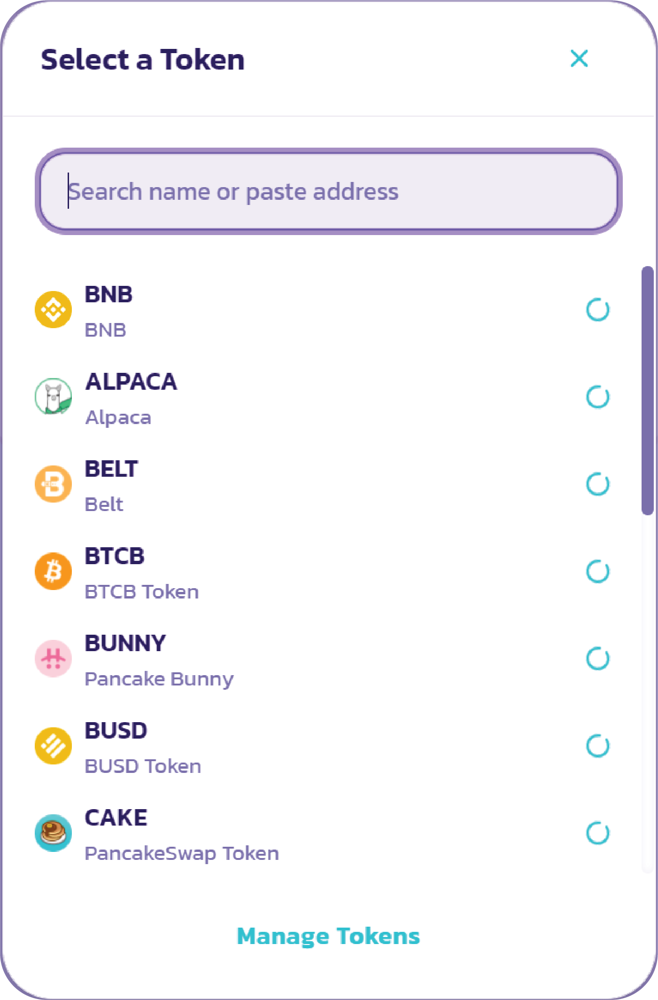

# Paano bumili ng GYRO

**Pano bumili ng GYRO**

Pumunta sa GYRO/USDT sa PancakeSwap

* [https://pancakeswap.finance/swap?inputCurrency=0x55d398326f99059ff775485246999027b3197955\&outputCurrency=0x1b239abe619e74232c827fbe5e49a4c072bd869d](https://pancakeswap.finance/swap?inputCurrency=0x55d398326f99059ff775485246999027b3197955\&outputCurrency=0x1b239abe619e74232c827fbe5e49a4c072bd869d)
* I-check ang  ‘I understand’ pagkatapos ay pindutin ang ‘Import’.

.png>)

* Mula sa Swap Exchange, ilagay ang halaga sa USDT na gusto mong bilhin pagkatapos ay i-click ang 'Enter'.

.png>)

* Ang PancakeSwap ay nagbibigay-daan para sa matalinong pagruruta. Maaari kang bumili ng GYRO sa iba pang mga asset bukod sa USDT (i.e., BNB, USDC, atbp.). Mag-click sa 'USDT' at may lalabas na popup; na nagbibigay-daan sa iyong pumili ng isa pang asset na bibilhin.

