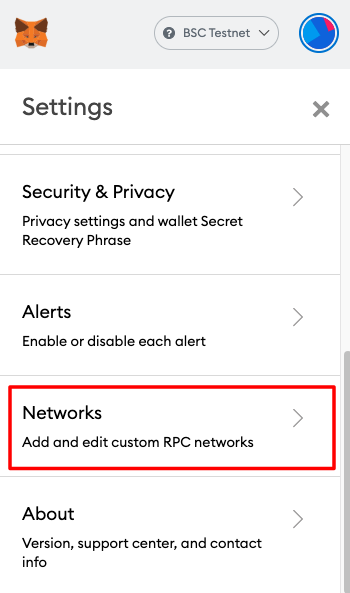
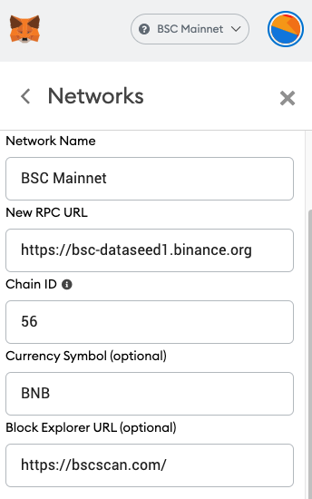

# Pag-configure sa Metamask

**Sundin ang mga hakbang na ito para i-setup ang Metamask para kumonekta sa BSC Mainnet**

**A. I-konekta ang Metamask sa BSC Mainnet**

* Pumunta sa Settings page

.png>)

* Magdagdag ng bagong Network

.png>)

* RPC: [https://bsc-dataseed1.binance.org](https://bsc-dataseed1.binance.org/)
* ChainID: 56
* Symbol: BNB
* Block Explorer: [https://bscscan.com/](https://bscscan.com/)

